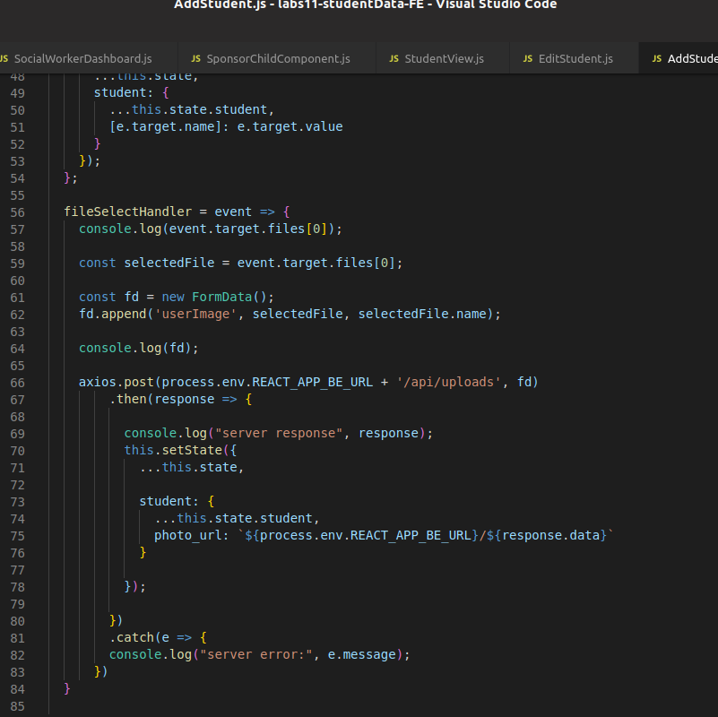

Part 1 - Individual Accomplishments this Sprint

Provide a paragraph (5-8 sentences) summarizing the work you did over the course of this sprint, including the challenges you faced, the tools you used, and your accomplishments

This week we fixed a really frustrating issue on the back end that was causing a lot of bugs on the front end. We worked together as a team to identify the best way to fix the issue and agreed on a solution. Then we all pitched in to fix parts of the front end that were affected by the changes that we made. We met with our UX contact on Wednesday, who suggested some changes that we should make on the front end, so we spent the rest of the week implementing those. I changed the way that uploading an image works to make it a smoother user experience. I also did some research into adding an upload by CSV feature.

Detailed Analysis

Pick one of your tickets and provide a detailed analysis of the work you did. This should be approximately ¼ page of text, and include screenshots if appropriate

https://github.com/labs11-studentdata/labs11-studentData-FE/commit/8c064c04bbecb3e5b8b363de64ed090717a7100a

For this ticket, I worked on fully integrating image uploads into the add a student process. I had already implemented uploading a photo last week, so I needed to figure out how to make that work with our front end add a student/admin components. I also needed to set up the backend to save the path to the photo to the database. I was able to successfully integrate and test image uploads and later improved on the user experience by making some changes suggested by our UX contact. 

Part 2 - Weekly Reflection

As a part of your journal entry, write ¼ to ½ a page reflecting on your experiences working with a team to make your product look and feel as good as it works under the hood. Describe how the duties of you and your team shifted tasks shifted towards the front end - and debugging the back end to improve UX.

We spent the first half of this week straightening out some major issues with our backend. The later half of the week was the spent updating the front end to work with the new back end changes. Communication was better this week, and the whole team made an effort to reach out to each other to offer help debugging areas of the front end. I think we were able to be much more productive this way by working together more effectively.

https://github.com/labs11-studentdata/labs11-studentData-BE/pull/64
https://github.com/labs11-studentdata/labs11-studentData-BE/commit/6a42f4afd593721bad5aaa6c56cda973a2e0f543
https://github.com/labs11-studentdata/labs11-studentData-BE/commit/8a4e5bb7058a674d578364224ece0fd49316ca1c
https://github.com/labs11-studentdata/labs11-studentData-BE/commit/046b90faf7031bd2e2028bc7c9535b165dc8b395
https://github.com/labs11-studentdata/labs11-studentData-FE/commit/7ad9a9283fac61c66712da917364230ca1b74e14
https://github.com/labs11-studentdata/labs11-studentData-FE/commit/7ad9a9283fac61c66712da917364230ca1b74e14
https://github.com/labs11-studentdata/labs11-studentData-FE/commit/8c064c04bbecb3e5b8b363de64ed090717a7100a
https://github.com/labs11-studentdata/labs11-studentData-FE/commit/d523d5b065679bc3e272d515b11d4f65d2577e2b
https://github.com/labs11-studentdata/labs11-studentData-FE/commit/edd2c0f2f95ce4bb6566c18fdbfe36ca700339f6
https://github.com/labs11-studentdata/labs11-studentData-FE/pull/95