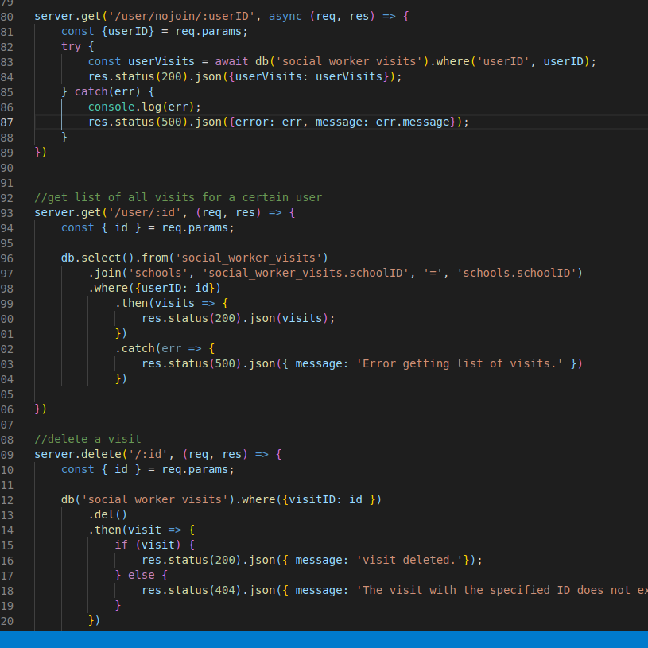

Part 1 - Individual Accomplishments this Sprint

Provide a paragraph (5-8 sentences) summarizing the work you did over the course of this sprint, including the challenges you faced, the tools you used, and your accomplishments

This week I spent most of my time fixing bugs and polishing the front end components I worked on. On Monday we focused on planning the week, documenting and prioritizing bugs. Tuesday-Thurday we focused on fixing the bug starting with the high priority bugs first. After we were finished fixing the bugs and polishing the front end, I decided to go back to working on one of our stretch features for admins to be able builk upload students by CSV file. I was able to get the upload and parsing of csv files working, but I wasn't able to get the records to correctly save to the database as new students. 

Detailed Analysis

Pick one of your tickets and provide a detailed analysis of the work you did. This should be approximately ¼ page of text, and include screenshots if appropriate

In this ticket, I added a table join to the backend to make things easier to work with on the front end. This was made possible after reworking the back end. I wasn't able to get table joins to work properly, so it took a lot of research and debugging to get it to work the way that it should. 

https://github.com/labs11-studentdata/labs11-studentData-BE/commit/b14b196a3403f38bd6a71bf18e0621897623f68c

Part 2 - Weekly Reflection

As a part of your journal entry, write ¼ to ½ a page reflecting on your experiences working with a team to bring an application to completion. The 90-90 rule is a quip referencing the very real difficulty of truly completing a project. Describe some of the final tasks that were the most difficult for your team to resolve - challenging bugs, layout and presentation woes, or anything else that was easy to get mostly working, but hard to get perfect.

Towards the beginning of the project, communication was lacking, but over time it did improve. The team put a lot of effort into making sure everyone was on the same page. I think that we could have been better at pacing the project, because it seems like we rushed to try to get everything done in the first two weeks. I think the project could have gone a little more smoothly if we had focused on building iteratively week by week rather than rushing to finish everything early. I think the most difficult task of the project was fitting together everyone's components/code and making sure everything worked together the way it should, but in the end we were able to sort most of that out. 

https://github.com/labs11-studentdata/labs11-studentData-FE/commit/47ad9dde9b3c65e295be8d12f7d54e45d8d8f550
https://github.com/labs11-studentdata/labs11-studentData-FE/commit/8fc4e9c33be9b275aae9e4e78e851c4f3e8d31de
https://github.com/labs11-studentdata/labs11-studentData-FE/commit/5a2ee8e46bdb2cecb53f8c14b66db3a0dad2cea9
https://github.com/labs11-studentdata/labs11-studentData-FE/commit/fdac4ba77223ad39ddb113304be01da11d26be02
https://github.com/labs11-studentdata/labs11-studentData-FE/commit/90a3bf092794927bcfd27e28ddb9fb3687152951
https://github.com/labs11-studentdata/labs11-studentData-BE/commit/44a87297007ca35d408febfaf0150c8d0ca9955c
https://github.com/labs11-studentdata/labs11-studentData-BE/commit/ece5abeb738af00076fa0fecb88856e35837963f
https://github.com/labs11-studentdata/labs11-studentData-BE/commit/b14b196a3403f38bd6a71bf18e0621897623f68c